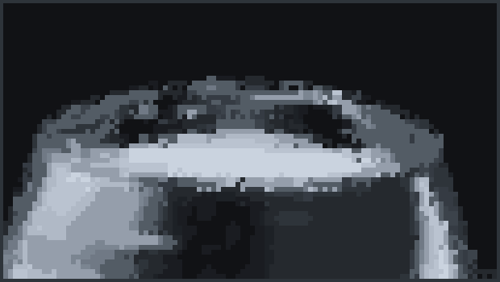

Experimenting with multi-colour subpixel rendering. See the `lib` folder for the meat and potatoes.

### Note:
For converting a texture to subpixels, I used exerro's method of getting the correct character. See: https://github.com/exerro/ccgl/blob/master/src/functions/texture_subpixel_convert.lua. Hopefully it's not seen as plagiarism 😓.

### Interactive physics simulation

### Video playback

